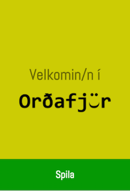
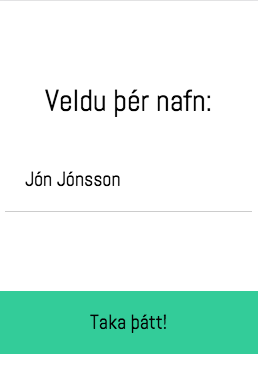
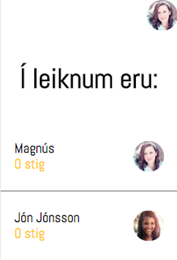
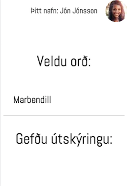
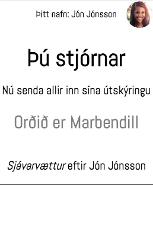
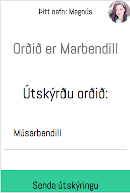
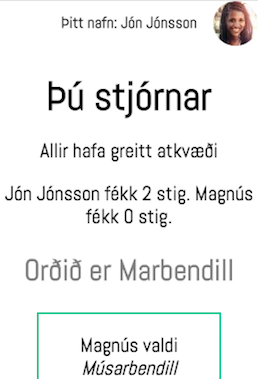

# Orðafjör
Word description game made with [Socket.IO](http://socket.io/). Players taka turns coming up with a word and description and other players try to guess the correct description or come up with a plausible description.

## Setup
`$ npm install`

`$ node index.js` or `nodemon`

## Screenshots

## Íslenskar leiðbeiningar
Leikurinn virkar þannig að serverinn er ræstur. Spilarar fara inn í leikinn á IP tölu serverins á porti 3000. Spilarar skrá sig síðan inn með nafni. Þegar allir sem vilja taka þátt eru komnir inn hefur sá sem vill byrja að vera stjórnandi leikinn. Stjórnandi velur orð og gefur því útskýringu. Hinir spilararnir sjá svo orðið og reyna að koma með líklega útskýringu á orðinu. Þegar allir spilarar hafa komið með útskýringu sendir stjórnandinn útskýringarnar út og spilarar kjósa þá líklegustu. Ef giskað er á útskýringu spilara fær hann 1 stig. Ef spilari giskar á rétta útskýringu fær hann 1 stig. Ef enginn giskar á rétta útskýringu fær stjórnandi 2 stig. Leikurinn endurtekur sig svo og annar spilari verður stjórnandi.
